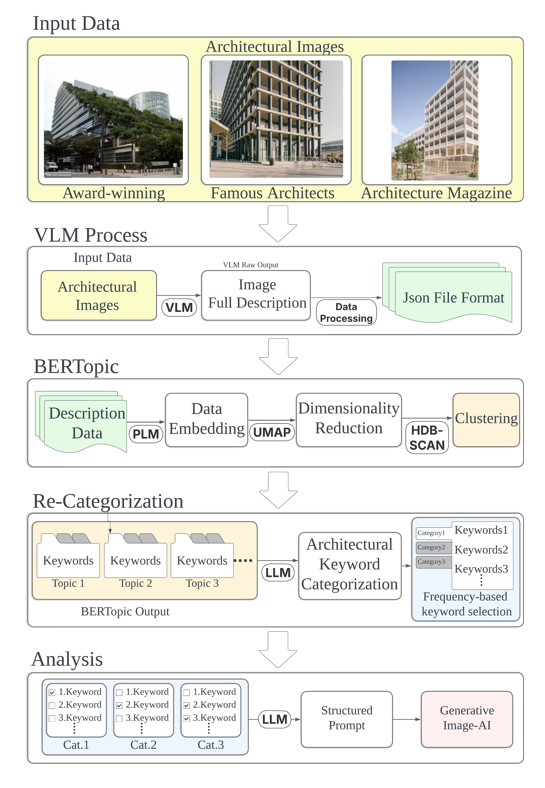

<!-- ─────────────── Language switcher ─────────────── -->
[🇰🇷 한국어 README](README.kor.md)

<h1 align="center">AI‑Architecture‑Trend‑Analysis 🏛️🤖</h1>
<p align="center">
  <a href="https://www.python.org/"></a>
  <a href="LICENSE"></a>
  <a href="https://github.com/WoosopYi/AI-Architecture-Trend-Analysis/stargazers">
    
  </a>
</p>

<table>
<tr>
  <!-- ──────────────── TOC (left) ──────────────── -->
  <td width="58%" valign="top">

  <details open>
  <summary><strong>📜 Table of Contents</strong></summary>

  - [Key Features](#key-features)  
  - [Methodology Overview](#methodology-overview)  
  - [Installation & Quick Start](#installation--quick-start)  
  - [Repository Structure](#repository-structure)  
  - [Citation](#citation)  
  - [Contributing](#contributing)  
  - [License](#license)

  </details>

  </td>

  <!-- ───────────── Diagram (right) ────────────── -->
  <td width="42%" align="right" valign="top">
    
  </td>
</tr>
</table>


## ✨ Key Features
| &nbsp; | &nbsp; |
| :-- | :-- |
| **Zero‑label captioning** with a pre‑trained VLM | Analyse thousands of images at negligible human cost |
| **BERTopic** topic discovery on captions | Generates semantically rich clusters beyond word‑counts |
| **Domain‑aware re‑categorisation** via LLM | Maps raw topics to architect‑friendly classes (facade, form, material …) |
| **Prompt auto‑generation** for generative image‑AI | Instantly visualise or share emerging trends |
| **Single Jupyter notebook** (`AI_Trend_Analysis.ipynb`) | End‑to‑end demo for research, teaching or practice |

---

## 🔬 Methodology Overview
<details open>
<summary>Click to expand the 5‑step workflow</summary>

1. **Input** Curate award‑winning projects, star‑architect works & magazine imagery.  
2. **VLM** Generate a full natural‑language description of each image.  
3. **BERTopic** Embed → reduce (UMAP) → cluster (HDBSCAN) → topic keywords (c‑TF‑IDF).  
4. **Re‑Categorise** LLM maps keywords to architectural categories.  
5. **Analysis** Keyword frequencies feed dashboards & *prompt templates* for generative AI.

*Full study: [`docs/AI_image_trend_paper.pdf`](docs/AI_image_trend_paper.pdf)*
</details>

---

## ⚡ Installation & Quick Start
```bash
# clone & install
git clone https://github.com/WoosopYi/AI-Architecture-Trend-Analysis.git
cd AI-Architecture-Trend-Analysis
pip install -r requirements.txt          # or Conda / Poetry

# run the end‑to‑end notebook
jupyter lab AI_Trend_Analysis.ipynb
```

> ℹ️ **Tip** Use a GPU‑backed environment for faster VLM inference.

---

## 📂 Repository Structure
```
AI-Architecture-Trend-Analysis/
├─ AI_Trend_Analysis.ipynb      ← main notebook
├─ Data/                        ← (optional) CSV / JSON inputs
├─ images/pipeline_diagram.png  ← figure shown above
├─ docs/AI_image_trend_paper.pdf← conference paper
├─ requirements.txt
└─ README.md  |  README.kor.md
```

---

## 📝 Citation
```plain
이우섭. (2025‑04‑23). AI 기반 이미지 텍스트화를 활용한 건축 이미지 데이터 추이 분석 
- 건축물 이미지 기반 트렌드 분석 사례를 중심으로. 대한건축학회 학술발표대회 논문집, 서울.
```

---

## 🤝 Contributing
Contributions are welcome! Feel free to open an **Issue** for bug reports or ideas,  
or submit a **Pull Request** to extend the toolkit.

---

## 📜 License
Released under the **MIT License** – free to use, modify and distribute with attribution.

